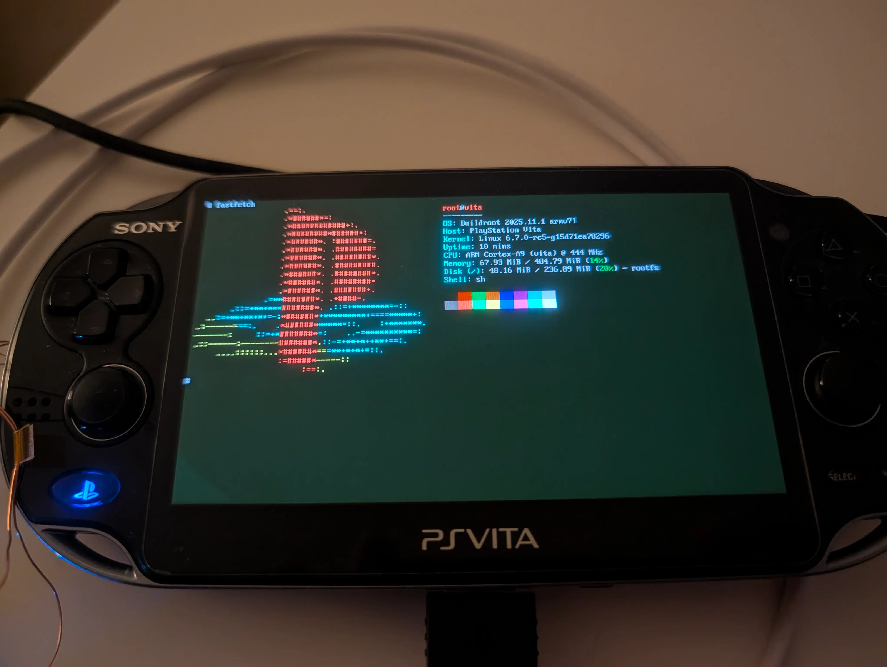

# Linux on the PlayStation Vita

<p align="center">
  
  <br>
  <em>My Vita (PCH-1103) with fastfetch (custom config, colours need some work)</em>
</p>

A port of Linux 6.12 to the PlayStation Vita (ARM Cortex-A9 quad-core SoC),
building on [xerpi's original Vita Linux port][xerpi-gist]. Boots to a
Buildroot shell with SMP, framebuffer, touchscreen, storage, and more.

xerpi's port last worked on Linux 5.x. Newer kernels would hang or corrupt
data during decompression due to stale PL310 L2 cache data (the
decompressor's CP15 cache ops don't propagate to the PL310, which requires
MMIO). xerpi [identified the root cause][xerpi-l2-discord] in the HENkaku
Discord. This port applies the fix and rebases onto Linux 6.12, along with
new drivers for SDHCI storage, the SCE partition table, and syscon-based
reboot.

## Status

**Linux boots to a shell.** This is an active development/research project.

Working:
- 4x Cortex-A9 CPUs (SMP), 480 MB RAM
- 960x544 OLED framebuffer
- UART serial console
- Touchscreen and button input (via syscon)
- GPIO LEDs, RTC
- eMMC storage (SDHCI) — all VitaOS partitions mountable
- WiFi (Marvell SD8787 via mwifiex) — custom syscon power sequencing
- Clean reboot back to VitaOS

Not yet working:
- USB (UDC base address unknown — needs RE)
- SD2Vita (needs VitaOS plugin setup first)
- Sony proprietary memory card (from Linux)

See [PROGRESS.md](PROGRESS.md) for detailed findings and next steps.

## Getting started

Requires a PS Vita (1000/2000/PSTV) on firmware 3.60 or 3.65 with
[HENkaku enso](https://henkaku.xyz/) and a UART serial connection.

```sh
git clone --recursive https://github.com/incognitojam/vita-linux-port.git
```

See **[BUILDING.md](BUILDING.md)** for prerequisites (macOS or Linux) and
build/deploy instructions. The short version: `make deploy` builds the
kernel, uploads it to the Vita over FTP, and boots Linux.

## Documentation

- [BUILDING.md](BUILDING.md) — Build prerequisites and instructions
- [PROGRESS.md](PROGRESS.md) — Detailed status, technical findings, next steps
- [HARDWARE.md](HARDWARE.md) — Peripheral addresses, register maps, pinouts

## Repository layout

| Path | Description |
|------|-------------|
| `linux_vita/` | Kernel source (git submodule, branch `vita-port-6.12`) |
| `vita-baremetal-linux-loader/` | Baremetal loader (git submodule) |
| `Makefile` | Build/deploy/boot orchestration |
| `serial_log.py` | Serial console with logging |
| `boot_watch.sh` | Boot progress monitor with stage tracking |
| `vita_cmd.sh` | Run commands on Vita over serial |

## Acknowledgments

This project builds on the work of many people in the Vita homebrew and
reverse engineering community:

- **[xerpi](https://github.com/xerpi)** — Original Linux port for the Vita,
  baremetal loader, libbaremetal, and extensive hardware research.
  [Build instructions][xerpi-gist] ·
  [Kernel repo](https://github.com/xerpi/linux_vita) ·
  [Baremetal loader](https://github.com/xerpi/vita-baremetal-linux-loader)
- **[Team Molecule](https://twitter.com/teammolecule)** (Davee, Proxima, xyz,
  YifanLu) — HENkaku, enso, and Vita security research that makes all of
  this possible
- **[TheFloW](https://github.com/TheOfficialFloW)** — Major contributions to
  Vita homebrew and exploits
- **[motoharu-gosuto](https://github.com/motoharu-gosuto)** — Reversed
  SceSdif/SceSdstor (source of SDIF GIC interrupt numbers used in our SDHCI
  driver)
- The **[HENkaku][henkaku-discord]** community and
  **[wiki](https://wiki.henkaku.xyz/)** contributors

See also the [HENkaku wiki Linux driver status page][driver-status].

## A note on AI

I use AI extensively in this project — for reverse engineering, hardware
analysis, writing and reviewing code, and understanding unfamiliar parts of
the kernel. I try to learn and understand as I go, using AI as a tool to help
me develop this rather than having it work autonomously. I do not plan to
upstream AI-generated code directly.

[xerpi-gist]: https://gist.github.com/xerpi/5c60ce951caf263fcafffb48562fe50f
[xerpi-l2-discord]: https://discord.com/channels/439481392548675594/439486116131897344/1194198617792184340
[henkaku-discord]: https://discord.gg/m7MwpKA
[driver-status]: https://wiki.henkaku.xyz/vita/Linux_Driver_Status
